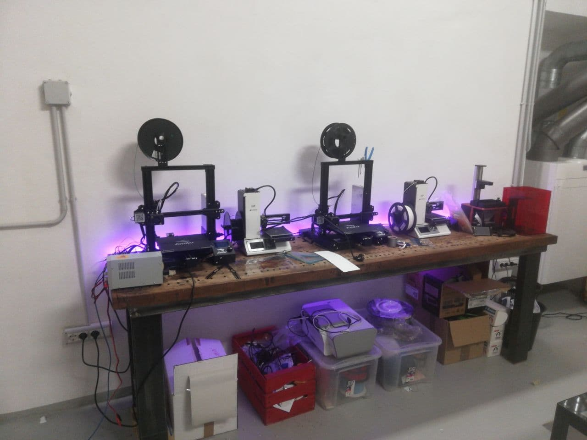
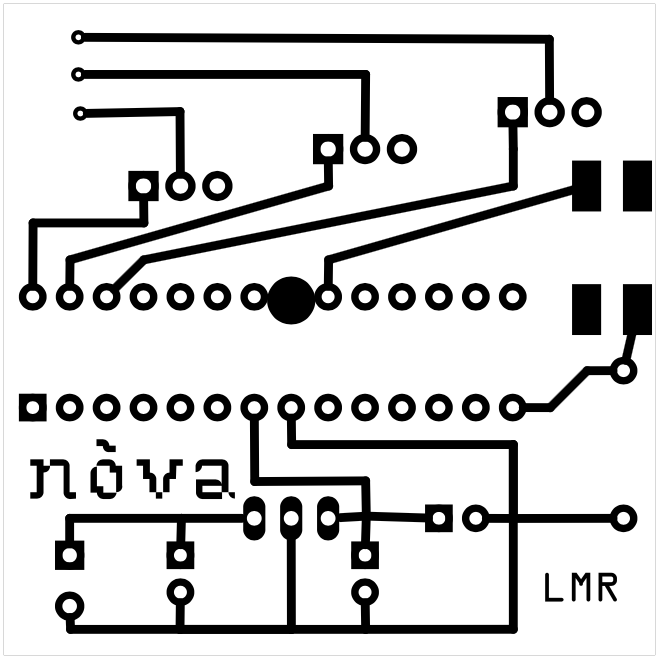

# desk-led-strip
arduino controlled desk RGB led strip

# program
long push change program
  - loop color
  - color1
  - color2
  - color3
  - color4
  
# futuri sviluppi
- IR sync multiple strip
- fix button program selection (delay)
