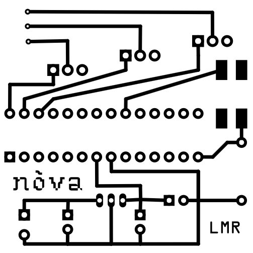
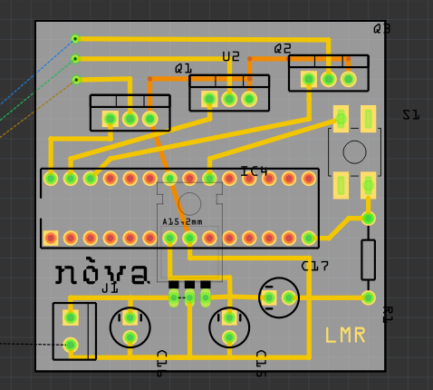

# desk-led-strip
arduino controlled desk RGB led strip
ATmega328 RGB led strip control

# program
long push change program
  - loop color fast
  - color1
  - color2
  - color3
  - color4
  
# futuri sviluppi
- fix button program selection (delay)
- loop slow
- IR sync multiple strip
